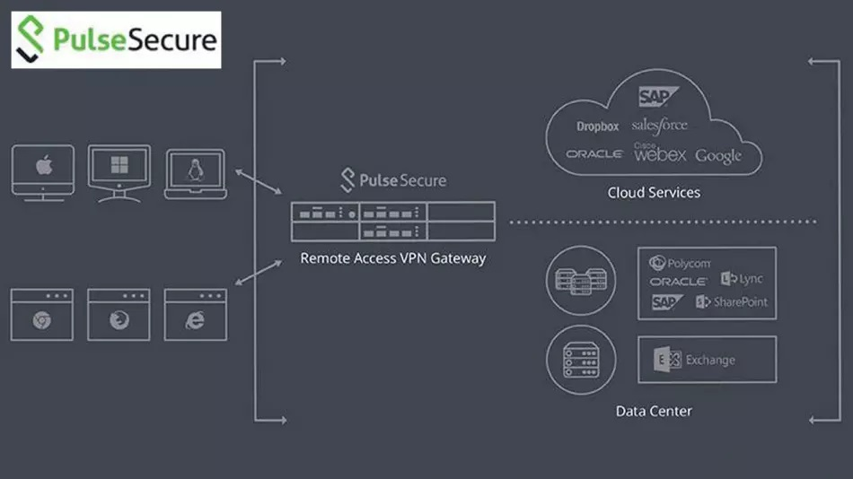
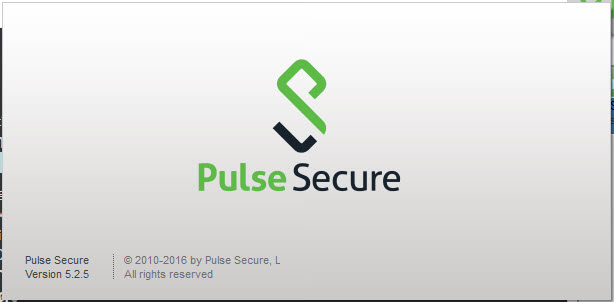
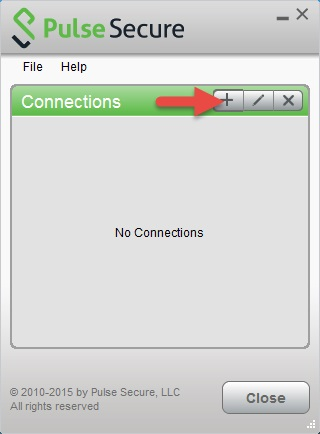
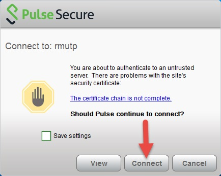
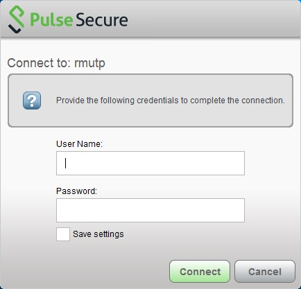

## Pulse Secure
Pulse Secure มาจากกลุ่มผลิตภัณฑ์ SSL VPN/NAC ของ Juniper ซึ่งในส่วนที่นำมาเสนอคือโปรแกรม Pulse Secure Client

## Pulse Secure Client
เป็นโปรแกรมที่ใช้สำหรับการรีโมทไปที่ใดที่หนึงซึ่งได้ตั้งค่า VPN ให้สามารถใช้งานได้ โดย Authentication มีทั้ง
 * Username & Password
 * Multi-factor Authentication (MFA)

 
## Multi-factor Authentication (MFA)
มีขั้นตอนการใช้งานดังนี้
 * เปิดโปรแกรม Pulse secure client และ เพิ่มข้อมูลการเชื่อมต่อ เช่น Name, Server URL

 * กด Connect และใส่ข้อมูล Usernam & Password และ กด Connect

