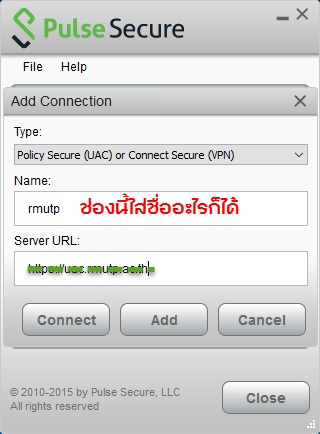

## Pulse Secure
Pulse Secure มาจากกลุ่มผลิตภัณฑ์ SSL VPN/NAC ของ Juniper ซึ่งในส่วนที่นำมาเสนอคือโปรแกรม Pulse Secure Client

## Pulse Secure Client
เป็นโปรแกรมที่ใช้สำหรับการรีโมทไปที่ใดที่หนึงซึ่งได้ตั้งค่า VPN ให้สามารถใช้งานได้ โดย Authentication มีทั้ง
 * Username & Password
 * Multi-factor Authentication (MFA)

 
## Multi-factor Authentication (MFA)
มีขั้นตอนการใช้งานดังนี้
 * เปิดโปรแกรม Pulse secure client และ เพิ่มข้อมูลการเชื่อมต่อ

 * เพิ่มข้อมูลการเชื่อมต่อ เช่น Name:, Server URL:
 
 

 * กด Connect 
 

 * ใส่ข้อมูล Username & Password และ กด Connect อีกครั้ง
 

 * กรอก Secondary Password ที่ได้จาก Token 
 

 * จะปรากฏข้อมูลการเชื่อมต่อสำเร็จดังรูป
 

