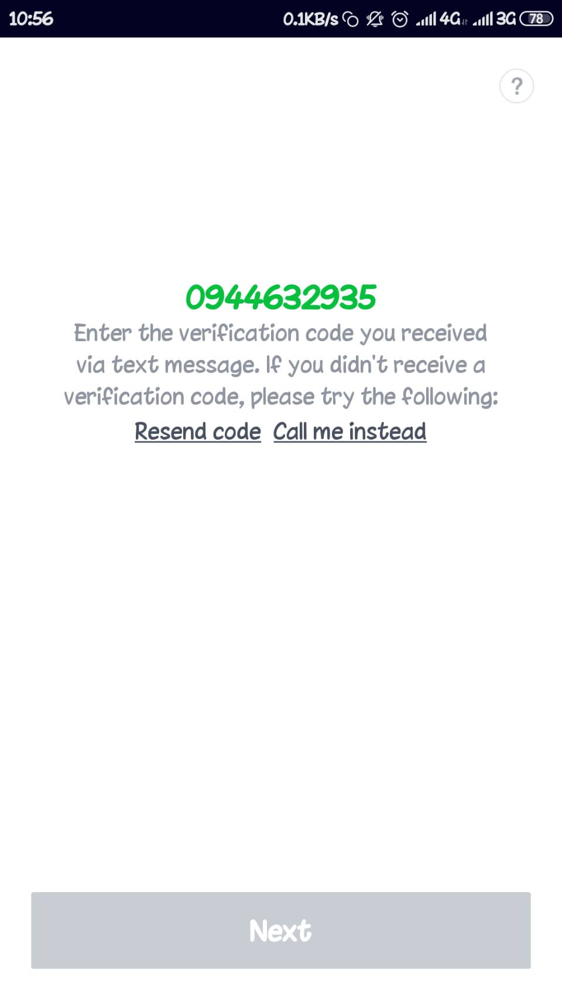
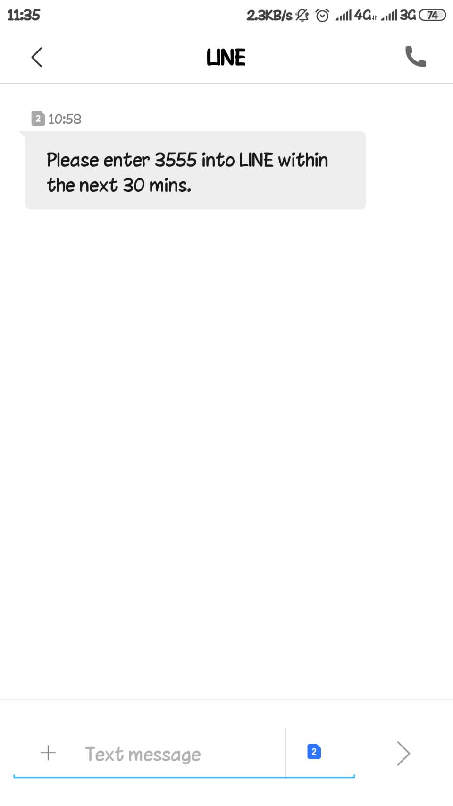
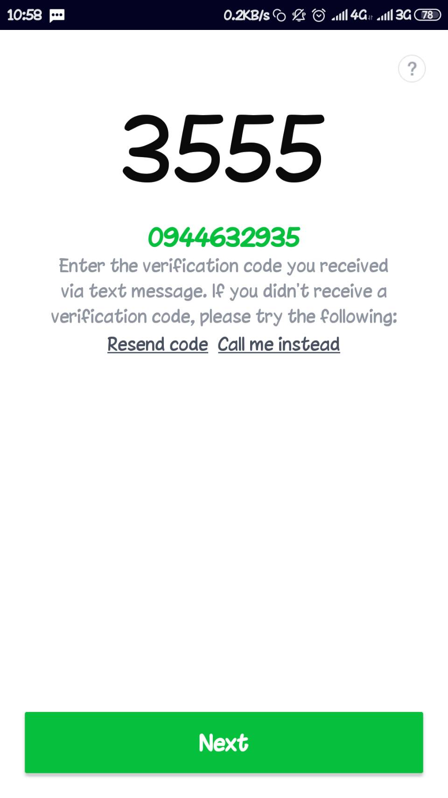
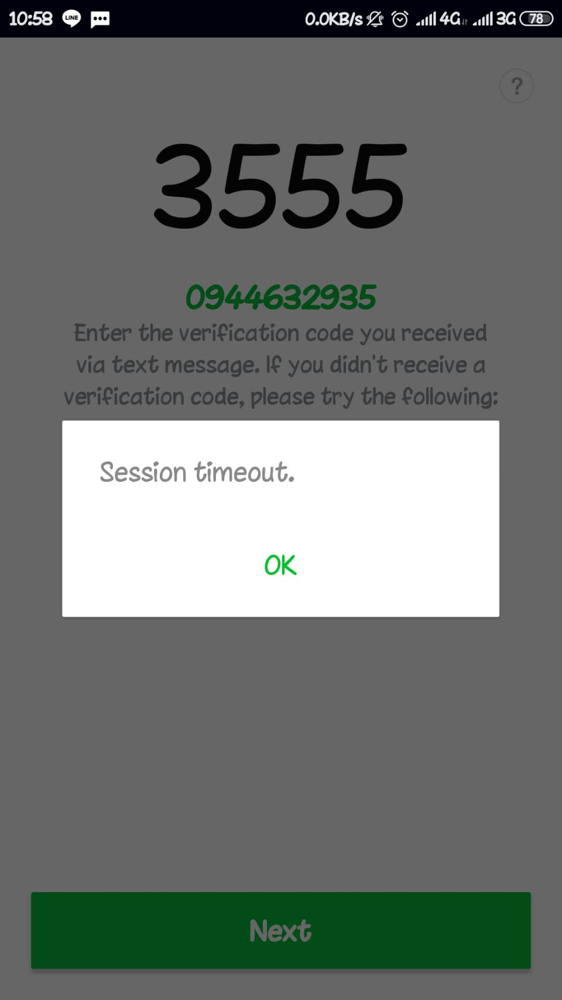

## 2.8 Single or Multi Factor One Time Verifier Requirements

* Test Case Name : Session timeout from duplicate session register mobile number

## Preconditions:

* LINE Account

* Application LINE on Mobile

## Input:

* Mobile number for register LINE account

## Action:

1. Input mobile namber to register on Application LINE Mobile

1. Recieve SMS number from LINE 

1. Input SMS number on Application LINE Mobile
  Application LINE Mobile (1), Application LINE Mobile (2)
  

## Expect Result:

Application LINE Mobile (2) Can't access to LINE

